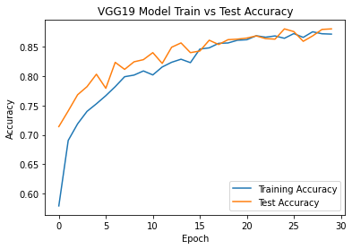
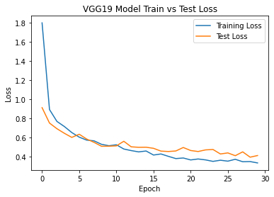

# Disease Detection

<h3>Targetting wheat related disease common in Bhopal, Madhya Pradesh.</h3>
<ol>
    <li> Crown and Root Rot </li>
	<li> Leaf Rust </li>
    <li> Wheat Loose Smut </li>
</ol>

Dataset Link: https://drive.google.com/drive/folders/1OHKtwD1UrdmhqxrpQEeF_X_pqKotxRGD
___

## Results:

